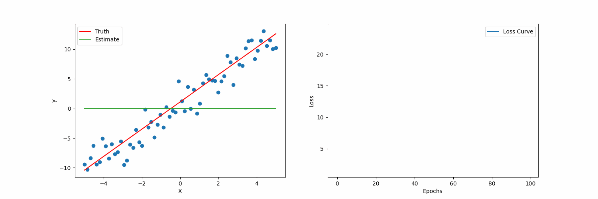

# Linear Regression from Scratch

This repository contains a Jupyter notebook that implements linear regression from scratch, without the use of external libraries like scikit-learn. The goal is to provide a brief intuition behind linear regression and gradient descent.



## Content

- **Introduction to Linear Regression**: A brief overview of linear regression, presenting the equation and the cost function.
- **Gradient Descent**: An introduction to gradient descent, including the gradient of the cost function.
- **Code Implementation**: Implementation of the algorithm and visualization of the process.

## How to Use

1. Clone the Repository

    ```bash
    git clone https://github.com/marlonmoratti/linear-regression-from-scratch.git
    cd linear-regression-from-scratch

2. Install Dependencies
   ```bash
   pip install -r requirements.txt

3. Run the Notebook
    ```bash
    jupyter notebook linear_regression_from_scratch.ipynb

## Contact

If you have any questions or suggestions, feel free to open an issue or reach out to me directly.
